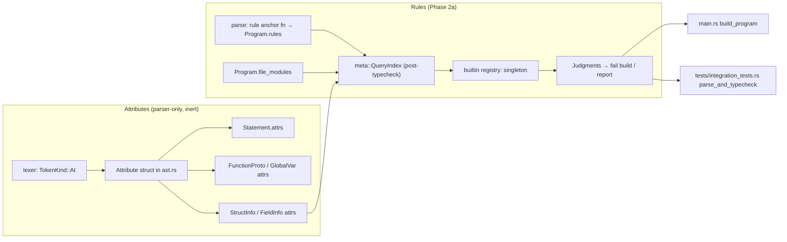

# Proposal: A Three-Hook Metasystem for User-Extensible Compilation

**Status:** Draft 0.3 — merged document. §§1–11 are the original design; §12 the execution model; §13 the Draft 0.2 post-scrutiny refinements; §14 the Draft 0.3 implementation-scrutiny amendments (2026-07-21: round-based elaboration replaces the worklist solver, checker-resolved `MethodCall` prerequisite, staging resolution); §15 the concrete phased implementation plan; Appendix A the worked example (formerly `Three-Hook-Metasystem-Example.md`).
**Scope:** Core compilation architecture. Surface syntax, module system details, and standard library are out of scope except where they constrain the design.

---

## 1. Thesis

The language is built around one stance: **the programmer states intent about structure and constraint, and the compiler enforces and exploits it.**

Extensibility and restriction are two faces of one mechanism. The language can change itself (expansions, transforms), and it can bind its own changing (rules). Restriction always outranks generation — enforced by phase order, not policy.

The core language is deliberately minimal: functions, structs, references, and the hook machinery. Everything else — traits, polymorphism, effect checking, foreign imports — is a library.

---

## 2. Pipeline Overview

```
parse                    closed grammar, token-tree fences
  └─ EXPANSIONS          user hook #1: pre-parse generation
       └─ elaboration    demand-driven typecheck (obligation solver)
            └─ TRANSFORMS  user hook #2: obligation handlers, AST rewriting
                 └─ RULES   user hook #3: post-typecheck judgment
                      └─ codegen (LLVM)
```

Three user-programmable hooks around a fixed core. Each hook lives exactly where its inputs exist:

| Hook | Phase | Sees | Produces | Cannot |
|------|-------|------|----------|--------|
| **Expansion** | pre-parse | raw token trees | new syntax → AST | see types, names, other items |
| **Transform** | during elaboration | typed AST, program facts | AST rewrites (re-checked) | create new surface syntax |
| **Rule** | post-typecheck | fully typed program, query API | judgments (errors, warnings, reports) | modify anything |

---

## 3. The Parser: Closed, With Fences

The grammar is fixed and boring, with two open productions:

1. **Attributes.** `@identifier` or `@identifier(args)`, legal in fixed positions. The parser attaches them to nodes as **inert metadata** — it never interprets them. Attributes are cargo, not keywords. Meaning is assigned later, or never. *Amended (§13):* the fixed positions include not only items (before functions, types, fields) but **statements** (`@debug x = f()`), because site-level decoration is a primary use case. Expression-position attributes are a later extension. Today there is **no `@` token at all** — this is greenfield lexer + AST work (see §15).

2. **Token-tree capture.** `identifier { ... }` where the identifier names an imported expansion: the parser counts delimiters, banks everything inside as a raw token tree, and attaches it to an expansion node. It does not attempt to understand the interior.

Consequences:

- A broken DSL inside braces cannot derail parsing of the rest of the file.
- Dumb tooling (brace matching, indexing) keeps working on any file.
- Every extension point is **syntactically visible**. You can always see where the host language ends. This is load-bearing: governance rules can only forbid what they can locate.

Deliberately rejected: reader macros / fully mutable grammar (Racket-style). Seamless syntax mutation would make the language's own restriction machinery unable to find what it governs.

---

## 4. Expansions (Hook #1 — Pre-Parse)

**Signature concept:** token tree in, AST out.

- Invoked by identifier at a capture site: `sql { SELECT ... }`, `derive_eq(Point)`.
- Superpower: arbitrary interior syntax. Limitation: sees only the captured tokens — no types, no resolved names, no other items. Anything derivable from an item's own tokens belongs here; anything needing resolved facts does not.
- **Parse contract:** an expansion declares whether its interior is `raw-tokens` or a host-language shape (`expr`, `item`, ...). Contracted shapes arrive pre-parsed as AST, so simple expansions never hand-parse tokens. (Direct fix for Rust's biggest proc-macro ergonomic tax.)
- **Locality constraint:** expansions must be *imported*, never defined in the file that invokes them. They run before that file typechecks, so they are compiled ahead of it, as separate modules the compiler loads. This constraint shapes the module system and must hold from v1.

---

## 5. Elaboration: Demand-Driven Typechecking

The typechecker is not a tree-walk; it is a **worklist solver**. This is the hardest single component in the design, and the piece that makes transforms sound. *Amended (§14.1):* v1 realizes this **specification** with round-based whole-program re-checking rather than an intra-checker worklist — the existing single-pass checker stays; the demand-driven behaviour below is the observable semantics, not the implementation.

- When checking hits something unresolvable — unknown method, missing impl, unbound name — it does not error. It files an **obligation**: a keyed record of the form *(kind, subject)*, e.g. `(missing-method, Point.foo)`.
- Checking continues elsewhere. Obligations sit on the worklist awaiting a handler.
- An error becomes real only at **quiescence**: no handler can make progress and obligations remain. The undischarged obligation *is* the error message, pointing at the original demand site — not at post-hoc rewrite wreckage.

Prior art (internal, never user-exposed): rustc's trait solver, Lean/Agda metavariable elaboration, Scala 3 typed macros, C++ on-demand template instantiation. Exposing the obligation queue as a user hook is this language's delta.

---

## 6. Transforms (Hook #2 — Obligation Handlers)

**Signature concept:** obligation + typed program facts in, AST rewrite out.

- A transform registers for an obligation key: "I answer `missing-method` obligations for types marked `@dynamic`."
- When it fires, its output AST is fed back into elaboration — which may discharge obligations or create new ones. Generation and checking interleave until quiescence.
- Transforms are the home for everything that needs resolved information: vtable synthesis from the set of implementors, `@logged` call-site wrapping, C-declaration import driven by actual usage, derived impls that depend on field *types* rather than field tokens.

### Determinism discipline (non-negotiable)

Interleaving makes check order observable. To keep compilation deterministic without proving confluence:

1. Obligations are keyed *(kind, subject)*.
2. **At most one registered handler per key.** Two handlers claiming the same key is a compile error.
3. Handlers must be **deterministic in their output** — the AST/judgment they produce is a function of program facts alone. *Amended (§13):* they **may** carry intra-compilation state (a handler is a function inside the hook, so state is natural and useful), provided obligations fire in a **total, source-determined order**. Purity of *output*, not statelessness, is the invariant. Cross-*compilation* persistence is out of scope. I/O is still forbidden (asserted, not proven — see §9). *Amended (§14.1):* under round-based elaboration the firing order is lexicographic (round, source position) — still total and deterministic across runs.

The two transform triggers — **repair** (a stuck type judgment, e.g. a coercion) and **decoration** (an attribute presence, e.g. `@debug`) — share one worklist. Repairs are seeded *lazily* on check failure and become errors at quiescence; decorations are seeded *eagerly* from every attribute site and **always fire, never diagnose**. Handled attributes are consumed so they cannot re-fire. See §13.

### Termination

Rewrite → re-check → rules is a fixpoint loop. v1 policy: **bounded rounds** (compiler flag, sane default). A transform that hasn't quiesced within the bound is an error naming the oscillating obligation. Provably-shrinking rewrites can relax this later; do not block on it.

---

## 7. Rules (Hook #3 — Post-Typecheck Judgment)

**Signature concept:** typed program in, judgments out. Rules modify nothing.

- Registration: `rule <anchor> <checker_fn>` where the anchor is a **type name** or an **attribute identifier**:
  - `rule singleton_t ensure_is_singleton`
  - `rule @nopanic ensure_graph_nopanic`
- Anchor kinds are an enum from day one (`type | attribute`, extensible to `function | module`) so new anchors never break existing rules.
- Rules run **last**, over everything — including expansion output, transform output, and rule code itself (rules apply to rules; self-failing rules need cycle detection, which is cheap). No generation step can smuggle in code the ruleset forbids. This is the constitution clause, enforced by phase order.
- Rules are written in the language, in the files they govern, JIT'd to LLVM after typecheck and executed against the program. Unlike expansions, they need no import constraint — by their phase, everything is compiled.
- **Checker-only rules** are first-class: rules that fail nothing and emit reports (data mining, audits).

### The query API is the real product

Rules never touch raw AST. They program against a query layer: `call_sites_of(fn)`, `instantiations_of(type)`, `implementors_of(trait)`, `has_attr(node, "@trusted")`, `reachable_from(fn)`. This keeps compiler internals rewritable forever.

**Two tiers, and the distinction is load-bearing (amended after scrutiny).** *Tier-1* queries — `call_sites_of`, `instantiations_of`, `has_attr`, `module_of` — really are dictionaries the compiler already builds; rules over them are ~10 lines and can gate compilation. *Tier-2* queries — `reachable_from`, `escapes`, `destroyed_on_all_paths`, dominance — are **flow-sensitive analyses the compiler does not build today** and must implement. Tier-2 rules are best-effort linters: they **emit warnings, not errors**, and must document their false-positive/negative envelope. The original "most of the layer wraps existing dictionaries" claim holds for Tier-1 only; do not promise Tier-2 as free. (The `must_destroy` leak checker in the worked example is Tier-2 — see Appendix A.)

### The transitive-property idiom

Transitive rules (effect-like properties: `@nopanic`, `@noalloc`) get a standard trio, documented as *the* idiom in the standard rule library:

1. **The walker** — graph reachability check with a conservative default at opaque boundaries.
2. **The trust attribute** — scoped exemption: `@trusted(nopanic)`, argument names the claim. Trusted-for-nopanic is not trusted-for-noalloc.
3. **The auditor** — checker-only rule listing every trust assertion: "show me everywhere we vouched instead of verified," as a one-liner.

### Hygiene rule: no silent attributes

After registration, every attribute occurring in the program must be **claimed** by at least one rule or expansion. Unclaimed attributes are an error naming the nearest match (`@nopanik` → "did you mean @nopanic?"). Escape hatch for deliberate inert markers is itself a rule/config. The system lints its own extension mechanism.

---

## 8. Governance: The Anti-Fragmentation Story

Infinite malleability historically fragments ecosystems (the Lisp curse). Here, the immune system is built from the same cells as the mutability:

- Extension points are syntactically visible (fences, attributes) → rules can find them.
- Rules can therefore bind them: `no expansions outside dsl/`, `transforms must be registered in MANIFEST`, `this module accepts no rewrites`.
- A project's ruleset is its **dialect constitution**: machine-enforced, versioned with the code.

The language does not solve feature composition in general. It gives every codebase the vocabulary to declare its dialect and enforce it. That is the defensible position.

---

## 9. What This Deliberately Is Not (v1)

- **Not an open typechecker.** The core judgment (functions, structs, references) is fixed. Transforms feed it; rules run after it; nobody redefines it. Two generation hooks and one judgment hook around a trustworthy core is a language; an open core is a compiler construction kit, and those don't get finished. Revisit only after months of real use show the query API is insufficient.
- **Not separate compilation.** Whole-program compilation in v1. Transitive rules and transform obligation resolution both want the whole program; a cross-unit rule-state story is future work. Do not promise separate compilation until it exists.
- **Not perfect C source interop.** Foreign import is a *library*: a transform/expansion pair that ingests C *declarations* (via libclang), emits typed signatures, and links against a real C compiler's output. Never translate C bodies (Zig's `@cImport` retreat is the cautionary tale).
- **Not crash-proof metaprogramming.** Purity of handlers is asserted and spot-checked, not proven, in v1.

---

## 10. Build Order

1. **Parser** — closed grammar, attributes as inert metadata, token-tree fences.
2. **Core checker as obligation solver** — hardest component; single-threaded, whole-program. Obligations + quiescence errors, *no user handlers yet*. (*Amended in §14.1: realized as round-based re-checking; the checker itself stays single-pass.*)
3. **Rules** — registration syntax, JIT of rule functions, minimal query API (call sites, instantiations, attribute lookup). Ship the singleton rule and the trio idiom as proof.
4. **Expansions** — token-tree capture, parse contracts, import-before-use constraint. Ship `derive_eq` as proof.
5. **Transforms** — handler registration, keyed obligations, bounded fixpoint. Ship trait-style vtable synthesis as proof.
6. **Standard rule library** — hygiene rule, audit idiom, governance examples.

Each stage is independently usable; each proof feature exercises exactly one hook.

---

## 11. Open Questions

- Expansion ordering when stacked on one item (`@logged @traced fn`) — pick inside-out or outside-in *now*, arbitrarily, and document it. [Resolved in §13: outside-in, leftmost applied last.]
- Obligation key granularity: is *(kind, subject)* fine-grained enough to keep the one-handler rule livable, or does it need scoping (per-module handler priority)?
- Rule state across compiler invocations (incremental builds) — deferred with separate compilation, but the durable-rule-state design should be sketched before the module system freezes.
- What the query API returns for code produced by transforms: original demand site, generated site, or both (source mapping policy).
- Diagnostics API for expansions/transforms: they must be able to register errors in their own vocabulary with spans into user-written source. Deserves first-class design before hook #2 ships, or error quality dies the C++ template death.

---

## 12. Execution Model — how metaprograms run inside the compiler

This section is the answer to the question the earlier drafts skipped: *all three hooks are user Aspect code that must execute inside the compiler.* Scrutiny found this is the real work — and that most of it is already de-risked.

**JIT is a solved primitive.** The compiler is Rust over **inkwell 0.9 / LLVM 19.1** (`Cargo.toml`). `CodeGenerator::generate(program) -> Module` (`src/codegen/generator.rs`) builds an LLVM module, and `jit_execute` / `jit_execute_main` already JIT-run Aspect — that is exactly what the `interpret` subcommand does (`src/main.rs`). There is **no AST interpreter** to extend; metaprograms compile to LLVM and run via `ExecutionEngine`, reusing the existing path.

**The marshalling ABI is the actual gap.** JIT'd Aspect must read and build the compiler's AST without touching raw Rust memory. Design:

- AST/program nodes are **opaque handles** (`u0*` or an integer id) into a compiler-side arena. The special structs (`Ast`, `Expr`, `Stmt`, `Fn`, `TokenTree`, `Program`, `Judgments`, and concrete list types) are thin handle-wrappers.
- `quote` / `Ast.*` constructors / every query function are `extern` **builtins implemented in Rust**, operating on handles. A metaprogram imports `std/meta`, whose signatures are `extern fn`s the compiler resolves to native implementations at JIT time.
- Consequence: the "query API is the real product" (§7) is literally this builtin surface. Its stability is what keeps compiler internals rewritable.

**Staged compilation driver (amended in Draft 0.3 — see §14.3).** The earlier draft called for topologically ordering all modules and JIT-compiling each hook module from a carved-up stream. That is not implementable against the real pipeline: `$import` **inlines** the imported module's tokens into one stream at the directive site (`src/preprocessor/modules.rs`), import cycles are legal, and there is no per-module parse. The amended design:

- **Rules need no staging at all.** They run post-typecheck, when the whole program — rule functions included — is already compiled (§7 says so; the earlier driver requirement was over-general).
- **Expansion staging (Phase 3) is a driver-level loop**, not a preprocessor/parser rewrite: for each hook-*providing* module `M`, compile `M` standalone — a fresh `Preprocessor` whose synthetic entry is `$import M` (its own imports inline recursively, exactly as designed) → parse → typecheck → codegen → JIT into the in-process **handler registry**. Then compile the user program as one stream exactly as today, with the parser consulting the registry at `ident { ... }` capture sites. Hook modules compile twice — once standalone, once inside the main stream, where their runtime parts must appear anyway and their metaprogram declarations parse as inert items. Acceptable under whole-program v1.
- **Constraints this imposes:** (i) hook-*providing* modules must form a DAG *among themselves* — an expansion used inside its own module or import cycle is infinite regress and a hard error (a deliberate carve-out from the general cycles-are-legal rule); (ii) the driver detects hook providers with a cheap pre-parse token scan for top-level `expansion` / `transform` keywords per file (tokens carry `file_id`; `PreprocessedSource::modules` maps file → module, and `PreprocessedSource::imports` (`src/preprocessor/mod.rs:90`) provides the import graph).

**Hygiene & safety (v1 honesty).** `quote` must **gensym** the identifiers it introduces or spliced user code is captured. A handler can still hang or crash the compiler (bounded fixpoint rounds cap the *loop*, not a single wild handler) and can call libc if it imports it, so "pure" is asserted, not enforced (§9). Accept for v1; a per-handler watchdog and an import allowlist are later work.

---

## 13. Design Refinements (post-scrutiny) — amendments to earlier sections

Consolidated from a heavy design review; each amends the section named.

- **Amends §3 — attributes below item level.** Attributes attach to **statements**, not only items, so `@debug x = f()` is legal. No `@` token exists today → greenfield lexer + `Attribute { name, args }` + an `attrs` field on `Stmt`/item nodes. Stacking order (`@a @b x`) is **decided outside-in** (leftmost applied last): `@a @b f` ≡ `a(b(f))`.
- **Amends §6 — deterministic, not stateless.** Handlers may carry intra-compilation state; the invariant is deterministic *output* plus a total, source-determined firing order. Repair vs decoration obligations share one worklist (seeded lazily vs eagerly); handled attributes are consumed.
- **Amends §6/§8 — coercion transforms are governed.** A user-defined `From -> To` coercion is an implicit conversion — the C++/Scala footgun, made worse by the flat module namespace (an import could change your coercions). Guardrails: a coercion fires **only after built-in coercion fails**, and **only where a rule opts the module in** (`allow coercion String -> u8*`). This folds coercion into the governance thesis (§8) instead of fighting it. *If in doubt, coercion transforms are the one sub-feature worth deferring past v1.*
- **Amends §7 — query API is two-tiered.** Tier-1 (dictionaries, gate-worthy) vs Tier-2 (flow-sensitive analyses the compiler must build, warning-only). Do not ship Tier-2 rules as hard errors.
- **New core-language dependency — value-blocks.** A `{ … }` in expression position whose `return` yields the block value is the primitive every wrapping transform stands on (it lets a decoration wrap a whole body without rewriting its control flow). It is a *language* feature, not a metasystem one, and needs its own short design note. Semantics to pin: disambiguation from list-init `{a, b}`, type = join of all `return`s, all-paths-return with a **void exception**, `return` binds to nearest block, `break`/`continue` pass through to enclosing loops. *(Landed 2026-07-14 — see §15 Phase 0 for the semantics as actually shipped.)*
- **Metalanguage ergonomics are a real prerequisite.** Aspect today has no `for-in`, generics, closures, or `match` (verified). Metaprograms are therefore verbose (index loops over concrete list structs), which makes **`quote` mandatory, not sugar**. `for-in` as a general language feature would help broadly; it is not a blocker.

---

## 14. Draft 0.3 Amendments — implementation scrutiny (2026-07-21)

A second scrutiny pass, this time against the compiler source rather than the design in the abstract, confirmed the architecture: **no structural flaw; build it.** The alternatives (Zig-style comptime interpreter, preprocessor token macros, external proc-macro processes, Rust `dlopen` plugins) were each examined and none dominates — comptime needs an interpreter that doesn't exist and provides no post-typecheck governance hook (the design's actual differentiator); token macros can never see types; external processes need a serialized stable ABI, strictly more work than in-process handles; Rust plugins abandon "metaprograms in the language." Three findings amend the plan. All line references verified against the tree at the time of writing.

### 14.1 Round-based elaboration replaces the intra-checker worklist solver (amends §5, §6, §10.2)

The worklist solver was the single riskiest component — a near-rewrite of the ~2.4k-line single-pass bidirectional checker (`src/typechecker/checker.rs`). It is replaced by an observably-equivalent engine that keeps the checker nearly untouched:

- **Handlers fire at the failure site, mid-pass.** The checker holds `&mut Expression` at every demand site (`assert_coercible`, `UndefinedFunction`, `UnknownField` — `src/typechecker/checker/expressions.rs`). If a handler is registered for the obligation key, the checker invokes it immediately, replaces the node in place, and bumps a `rewrites_this_round` counter; otherwise it stamps poison and records the obligation. Never map errors back to nodes post-hoc: `TypeCheckError` carries only a `Position`, and positions are not node identities (generated code shares them).
- **Driver loop:** `loop { fresh TypeChecker; check whole program; if rewrites_this_round == 0 break; if round > bound → error naming the oscillating (kind, subject) }`. Only the final round's errors are reported. Whole-program re-checking is O(rounds × program) — a non-issue under §9's whole-program-only constraint; §6's bounded-rounds flag carries over verbatim.
- **Handler state persists across rounds; handled attributes are consumed.** Intra-compilation state (e.g. `@debug`'s `next_id`) lives in the handler registry, outside the per-round `TypeChecker`; consuming the attribute on firing means a from-scratch re-check cannot re-fire it and ids cannot drift. Firing order is lexicographic (round, source position) — a slight deviation from §6's "total, source-determined order" (a site *generated* in round 2 at an early source position fires after an *original* round-1 site at a later position), but still total and deterministic across runs, which is what the invariant exists for.
- **The poison/`Unresolved` sentinel is still required.** Unresolved sites currently return `VOID` placeholders and would spawn cascade errors within a round and in the final diagnostic round.
- **Handler-synthesized items must be registered** through `ModuleSymbols::add_function` (and the struct/method registries) as part of applying a rewrite — the checker resolves calls through the symbol table, not by scanning the AST. Synthesis is actually *easier* under rounds: new items are simply present from the start of the next round.
- **Idempotence of re-checking is the load-bearing assumption** — the property needed is that re-checking an *already-checked* `Program` is a fixpoint, guarded permanently by a regression test: check, clone the `Program`, re-check the clone with a fresh checker, `assert_eq!`. The checker's only structural rewrite is the checker-resolved `MethodCall` lowering (§14.2, landed 2026-07-21): a **one-shot** lowering to a `FunctionCall`/`IndirectCall` whose re-check is stable (a resolved node is a plain call — covered by `mcall_resolution_is_idempotent_on_recheck`). It is core lowering, not a handler rewrite, so when the rounds driver lands it must **not** bump `rewrites_this_round` (or a program containing metaprogram `MethodCall`s would spuriously force an extra round). Beyond that, the checker only stamps `expr_type` and narrows literals.

Semantic equivalence was checked against all three v1 use cases: `String -> u8*` coercion (the rewrite point *is* the built-in-coercion failure point, so "fires only after built-in coercion fails" is trivially satisfied), `@debug` decoration (round 1 for source attrs, round N+1 for handler-generated ones), and vtable/missing-method synthesis. No incremental-compilation door closes that the worklist design kept open — both stamp and rewrite the single AST in place, and §11's cross-invocation rule state was already deferred.

### 14.2 New Phase 0 prerequisite: checker-resolved `ExprKind::MethodCall` (amends §15 Phase 0)

**The parser is not type-agnostic, and the AST is not purely syntactic.** Method-vs-field dispatch, instance/static resolution, and `Type$method` mangling all happen at *parse* time from parse-time `expr_type` (`parse_dot_postfix` / `build_method_call`, `src/parser/expressions.rs:1141–1280`; compound assignment desugars similarly). AST built by a metaprogram — `quote { $(site).c_str() }`, any transform rewrite — has no receiver types at parse time, so that lowering is unavailable to it; without a fix, hook #2a's one-line coercion handler is unimplementable. Prerequisite for Phases 3/4 (tagged M): an `ExprKind::MethodCall { base, name, args }` node that the *typechecker* resolves and mangles (it already resolves fields with exactly the needed information); the parser can migrate to the same node later. Related accepted hole: import visibility is enforced only at parse time (`Parser::check_import_visibility`, `src/parser/expressions.rs:173-193`), so transform-generated code bypasses it — accept and document for v1. The `public type` module-privacy gate (`check_struct_visibility` / `ParserError::PrivateType`, landed 2026-07-21) lives at the same parse-time sites and shares the hole. And the `MethodCall` migration itself must carry the instance-call privacy gate along — today `build_method_call` checks the receiver type's module visibility, and a checker-resolved node that skips it would silently un-gate private types' methods.

### 14.3 Staging: none for rules, standalone-compile loop for expansions (amends §12)

`$import` inlines every file into one token stream and import cycles are legal, so the old "topologically order modules, JIT each" driver could not be carved out of the existing pipeline. §12 now carries the resolution in full: rules need no staging at all; expansions get a driver-level loop that compiles each hook-providing module standalone (fresh `Preprocessor`, synthetic `$import M` entry) and registers its hooks; hook-providing modules must form a DAG among themselves; providers are detected by a pre-parse token scan. Consequence for §15: the staged driver disappears from Phase 2 entirely and shrinks to a bounded driver change in Phase 3.

### 14.4 Smaller amendments

- **Phase 2 splits into 2a and 2b.** *2a — rules as Rust builtins*: the de-risk step promoted to a shippable milestone (working governance, zero JIT risk). *2b — JIT'd Aspect-authored rules*: needs a codegen knob, because `optimize` always runs `globaldce` (`src/codegen/generator.rs:364`) and private visibility lowers to internal linkage — rule functions would be stripped or unresolvable. The judge module forces external linkage on rule fns and skips `globaldce`; the artifact module keeps stripping them.
- **Rule execution must be a library entry point** (`aspect::meta`), called from both `build_program` (`src/main.rs`) and the test harness's `parse_and_typecheck` (`tests/integration_tests.rs`) — the harness never goes through `main.rs`, so driver-only wiring would leave the entire corpus blind to rules.

---

## 15. Concrete Implementation Plan

Phased, checkbox form. Each phase is independently useful; earlier phases de-risk later ones. Effort tags from a parser/codegen survey: (S)mall / (M)edium / (L)arge.

**Approved first slice (2026-07-21):** the §14 amendments (this document) + Phase 0 **Attributes** + **Phase 2a** rules-as-builtins. Everything else — std/meta ABI, JIT'd Aspect rules, hygiene rule, `MethodCall`, expansions, transforms — is explicitly deferred.



### Phase 0 — Prerequisites (language + infra)

- [x] **Module system** — finish Preprocessor-Infrastructure (`$module`/`$import`, `-I`). Two-pass prototype registration already landed. (M)
- [x] **Value-blocks** — *landed 2026-07-14.* `ExprKind::ValueBlock`; parser disambiguates vs list-init by speculative list parse with rollback (`parse_brace_expression`); checker: target-directed / first-return-synthesized typing + conservative all-paths-return (loops never count; bare `return` rejected — no void exception, a value block always yields a value); codegen: entry-block result slot + `vblock.exit`, `return` rerouted via `value_block_stack`. Spec: doc/09 §Value blocks. Regression: `tests/programs/value_block.ap`.
- [x] **Attributes** (M) — inert cargo; `@` is a hard lexer error today, so nothing regresses. No warning for unclaimed attrs (no warning channel exists; the Phase 2b hygiene rule makes them hard errors later). Only syntactic validation: `@` must be followed by an identifier.
  - `TokenKind::At` next to `Dollar` in `src/lexer/tokens.rs` + `Display` arm; `'@' => TokenKind::At` in `scan_token` (`src/lexer/scanner.rs:155-169`).
  - `Attribute { name: String, args: Vec<Expression>, pos: Position }` in `src/parser/ast.rs`, deriving `Debug, Clone, PartialEq`; `attrs: Vec<Attribute>` on `Statement` (keep `Statement::new(kind, pos)` arity — default empty, attach after construction), `FunctionProto`, `GlobalVar`; and on `FieldInfo` / `StructInfo` (`src/symbol/module.rs:47` / `:72`) with a `ModuleSymbols` setter for struct-level attrs.
  - Shared helper `Parser::parse_leading_attrs() -> Result<Vec<Attribute>, ParserError>`: loop `@` + `ident!()` + optional `(` comma-separated `parse_expression` `)`, with `skip_newlines()` between attrs so an attribute on its own line binds to the following statement/item. Vec order = source order = outside-in (leftmost applied last, §13).
  - Statement position: collect in `parse_statement` (`src/parser/statements.rs:60`) after `skip_newlines()`, dispatch through `STATEMENT_TABLE` as today, attach to the returned statement. Item positions: collect in the `do_parse_program` pass-1 loop (`src/parser/program.rs:62`) **before** the `public`/kind modifiers (grammar: `@attr public fn ...`), thread into `parse_function` (`src/parser/declarations.rs:284`), `parse_struct_def` (`:15` — struct attrs to `StructInfo`), `parse_global_var` (`:345`), and the asm/naked paths; inside `parse_struct_def`'s member loop (`:39`), attrs before `public` attach to the field or method. Reject attrs on constructs that take none (e.g. `alias`) with a clear error. Checker and codegen: zero changes.
  - Tests: `tests/programs/attributes_inert.ap` (attrs on fn/type/field/global/statement, stacked `@a @b`, args forms `@x` / `@x(1, "s")`, own-line attr; `# expected:` return value); `tests/programs/failures/attr_missing_name.ap`; parser unit tests for stacking order and `@` at EOF; lexer token test.
- [x] **Checker-resolved `MethodCall`** (M) — §14.2. `ExprKind::MethodCall { base, name, args }` added; the typechecker resolves and mangles it (`resolve_method_call` / `build_method_call_node` in `src/typechecker/checker/expressions.rs`), rewriting it **in place** into a `FunctionCall` (static or instance method) or `IndirectCall` (fn-pointer field), so codegen stays method-agnostic. Reproduces the parser's dispatch: static-vs-instance, `Type$method` mangling, value-receiver autoref (deeper-than-one pointers rejected), method-vs-fn-ptr-field, and the form-strictness errors (new `MethodCallForm`/`InvalidMethodReceiver`/`NotCallable` `TypeCheckError`s). The per-method gate (`MethodSig.vis`) rides along for free via `check_call → check_method_access`.
  - **Privacy carve-out (language-designer ruling, 2026-07-21):** the `public type` *cross-module* gate is deliberately **not** reproduced in the checker — it has no `file_id → module` map — matching §14.2's accepted "transform-generated code bypasses import visibility" hole. Real user code is unaffected because the parser is **not** migrated in this slice and keeps emitting pre-resolved, fully-gated calls.
  - **Coverage:** no `.ap` source can construct a `MethodCall` (the parser never emits one), so this is covered by exhaustive Rust unit tests (`checker/tests.rs`, the twelve `mcall_*` cases), an explicit and justified exception to the corpus-failure-fixture rule for this internal-infra slice. `09-syntax-reference.md`/`handbook.md` need no change (no user-facing syntax); `05-typechecker.md` documents the node.
  - **Future — parser migration (deferred):** migrating the parser to emit `MethodCall` (deleting `build_method_call`, gaining -O0/-O2 corpus coverage) must move the `public type` gate into the checker with it, which needs `Program::file_modules` (Phase 2a already wants this, §297) **and** `module_imports` threaded into `TypeChecker`.
- [ ] **Metaprogramming std (`std/meta`)** — opaque-handle special structs + `extern` builtins (`Ast`/`Expr`/`Stmt`/`Fn`/`TokenTree`/`Program`/`Judgments` + `*List` with `.count()/.at()`); compiler-side arena + handle registry. Handles are `u64` at the extern boundary (never one-field structs across the Rust↔JIT seam); `MetaCtx` thread-local around each hook invocation; builtins registered via `ExecutionEngine::add_global_mapping`. Needed from Phase 2b onward. (L)
- [ ] **`quote` / `$(…)`** — parse contract, desugar to `Ast.*` builders, **hygienic gensym** (rename identifiers *bound inside* the quote plus their in-quote uses; free identifiers deliberately resolve unhygienically — §12's v1 honesty). Desugars at hook-module compile time using the real parser; no generics required anywhere (hand-monomorphized `*List` structs match the language's style). Needed from Phase 3 onward. (L)

### Phase 1 — Round-based elaboration (replaces the obligation-solver refactor; see §14.1), no user handlers

- [ ] Obligation/handler registry type + rounds driver loop as a library function (used by `build_program` *and* the test harness); bounded-rounds compiler flag. (M)
- [ ] Thread the registry into the checker at the demand sites (`assert_coercible`, `UndefinedFunction`, `UnknownField` in `src/typechecker/checker/expressions.rs`) so handlers fire mid-pass at the `&mut` node; count rewrites per round. (M)
- [ ] **Poison/`Unresolved` sentinel type** to suppress cascade errors downstream of an unresolved demand (today `VOID` placeholders generate spurious secondaries). (M)
- [ ] Idempotence guard test: parse a representative corpus file, check, clone the `Program`, re-check the clone with a fresh `TypeChecker`, `assert_eq!`. (S)
- [ ] Regression: existing error suite unchanged (behaviourally a no-op with no handlers registered).

### Phase 2a — Rules as Rust builtins (no JIT; shippable governance)

**Landed 2026-07-21** (language-designer: Approved with changes, folded in).
Two deviations from the sketch below: `instantiations_of` counts **construction
expressions only** (`StructLiteral` + value `alloc`), *not* value-typed
declarations — counting both double-counted `T v = T{…}` (literal + decl); and a
second builtin `audit` (report-only, any anchor) ships beside `singleton` to
exercise attribute anchors and the report→warnings channel. User docs: handbook
§16, syntax-ref grammar; compiler doc `doc/compiler/11-rules.md`.

- [x] **`rule <anchor> <fn>` declaration.** Soft keyword in `do_parse_program`, inserted **before** the global-var branch (`src/parser/program.rs:128` — load-bearing: any leading `Identifier` currently enters the global-var path). Disambiguation: treat as a rule iff `peek() == Identifier("rule")` AND (`peek(1)` is `At`, OR `peek(1)` and `peek(2)` are both identifiers) — a named-type global is at most `Type name [= …]` (two identifiers), so `rule T f` (three) and `rule @a f` are unambiguous, and a user type actually named `rule` keeps working. Reject `public`/`extern` prefixes on rules (`defines_a_global` at `:86` would otherwise wave `public rule` through). AST: `RuleDecl { anchor: RuleAnchor, checker_fn: String, pos: Position }`, `enum RuleAnchor { Type(String), Attribute(String) }` (extensible per §7), `Program::rules: Vec<RuleDecl>`. (S–M)
- [x] **`Program::file_modules: Vec<String>`** — `Parser.file_modules` exists (`src/parser/expressions.rs:94`) but is dropped at `Program` construction (`program.rs:164`); `module_of` needs it (parallel to `source_files`; empty ⇒ root module `""`). (S)
- [x] **Tier-1 query layer** — new `src/meta/query.rs`, `pub mod meta` in `src/lib.rs`. `QueryIndex::build(&Program)` post-typecheck, one AST walk: functions list; `call_sites_of(name)` (from `ExprKind::FunctionCall`/`FunctionRef`, mangled `Type$method` names included as-is); `has_attr(…)` over `FunctionProto`/`GlobalVar`/`StructInfo`/`FieldInfo`/`Statement`; `module_of(pos)` via `pos.file_id` → `file_modules`; `instantiations_of(struct_id)` from `ExprKind::StructLiteral`, `ExprKind::Alloc` of the struct type, and value-typed declarations (`TypeBase::Struct(id)`, `pointer_depth == 0`) — rustdoc defines exactly what counts as an instantiation. (M)
- [x] **Builtin registry + `singleton`** — new `src/meta/mod.rs` (+ `builtins.rs`). `Judgment { severity: Error|Report, pos: Position, rule: String, message: String }`; registry name → `fn(&QueryIndex, resolved_anchor) -> Vec<Judgment>`. Entry point `meta::run_rules(&Program)` first **validates** each `RuleDecl`: type anchors via `program.symbols.struct_id`, attribute anchors resolve to the set of attr carriers (making attributes demonstrably useful already), unknown `checker_fn` → error with a did-you-mean (mirror the preprocessor's directive suggestions). The `singleton` rule: >1 instantiation of an anchored type ⇒ one error judgment per extra site. (S–M)
- [x] **Wiring.** `build_program` (`src/main.rs:325`): after typecheck, run `meta::run_rules`; format `file:line:col: rule <name>: <msg>` (same shape as `TypeChecker::format_error`); error severity fails the build, report severity → stderr, build continues. Same call in `tests/integration_tests.rs::parse_and_typecheck` (`:40`), folding error judgments into the returned error string so failure-corpus tests can assert on them (§14.4). (S)
- [x] **Tests + docs.** `tests/programs/failures/rule_singleton_violated.ap` (two instantiations, fragments `"rule", "singleton"`); `tests/programs/rule_singleton_ok.ap`; `tests/programs/failures/rule_unknown_checker.ap`; a bad-syntax rule failure test; one `rule @attr fn` test anchored on an attributed type. Short `@attributes` (inert, reserved) and `rule` sections in `doc/handbook.md` + `doc/compiler/09-syntax-reference.md`, matching the value-block documentation style. (S)

### Phase 2b — JIT'd Aspect-authored rules

**First slice landed 2026-07-22:** the `rule fn` descriptor, conditional
`std/meta` injection, the meta-only gate, the judge module (host-target,
JIT-only) with a scalar-ABI trampoline over the real `byval`/`sret` checker ABI,
and a `singleton` written and run in Aspect. Deferred: the hygiene rule, the
full ~40-builtin read surface (only the singleton slice is implemented), and
attribute-anchored rule fns. See `doc/compiler/11-rules.md` and
`Meta-Module-JIT-Interface.md` §10.

- [x] **std/meta handle ABI** (Phase 0 item) live: `extern fn meta_*` builtins registered on the judge engine via `add_global_mapping`; Tier-1 builtins + the `Judgments` out-struct (`meta_judgments_new`, `meta_judgment_error/warn`); strings cross as `u8*`. (M–L)
- [x] **Judge-module JIT**: codegen knob forcing external linkage on rule fns and skipping `globaldce` for the judge module only (§14.4); invoke rule fns via `get_function_address` transmuted to `extern "C" fn(u64) -> u64`; judge `Context`/`Module`/`ExecutionEngine` live only for the judgment scope (a self-owning cell arrives with Phase 3's persistent registry). (M)
- [x] **Port `singleton` to Aspect**; **hygiene rule** — every attribute claimed by a rule/expansion, did-you-mean on unclaimed (hoist the preprocessor's `levenshtein` into a shared util); ship the trust/audit trio as proof. (M)

### Phase 3 — Expansions

- [ ] **Standalone-compile staging driver** (§12, amended; §14.3): token-scan detection of hook providers, DAG check over the provider subset, per-module compile → JIT → handler registry; the user program then compiles as one stream against the registry. (M)
- [ ] Token-tree capture at `ident { … }`; parse contracts (`raw-tokens` / `expr` / `item`); import-before-use enforcement. (M–L)
- [ ] Ship `derive_eq` as proof; then `interp` (bundled in `std/fmt` with its opt-in coercion transform). (M)

### Phase 4 — Transforms

- [ ] On the Phase 1 rounds engine: **decoration** obligations collected eagerly from attr sites each round (always fire, consume the attr), **repair** obligations fire at the checker's failure sites; bounded rounds (§14.1). (L)
- [ ] `transform From -> To` (coercion, governance-gated) and `transform @attr(NodeKind) -> NodeKind` (decoration). (M)
- [ ] Ship `@debug(stmt)` (decoration) and vtable synthesis (repair/synthesis) as the two proofs. (M–L)

### Phase 5 — Tier-2 query API + honest linters

- [ ] Build flow-sensitive analyses (reachability, escape, dominance) behind Tier-2 queries. (L)
- [ ] `must_destroy` as a **warning** linter with documented blind spots; the transitive-property trio (`@nopanic` walker / `@trusted` / auditor). (M)

### Cross-cutting, do-not-skip

- [ ] **Diagnostics API** (§11) — hooks register errors with spans into user source; design before Phase 4 or template-style error soup sets in.
- [ ] **Source mapping** (§11) — what a query returns for transform-generated code (demand site vs generated site).
- [ ] **Safety** — per-handler watchdog + libc import allowlist (post-v1, but track it).

### First-slice verification

- `cargo test` — full suite stays green (attributes inert, rules fire only when declared); new `.ap` files are auto-discovered by `generate_tests!` and run at both -O0 and -O2.
- Idempotence guard test in `tests/integration_tests.rs` (protects §14.1's core assumption going forward).
- By hand: `cargo run -- compile` on a two-instantiation singleton program shows `file:line:col: rule singleton: ...`; removing one instantiation compiles and runs.

---

## Appendix A — Worked Example: The Three Hooks on One Type

**Status:** Illustrative — the metasystem is unimplemented, so the hook-*definition* syntax
below is **proposed** (consolidated from design discussion). The hook-*using* code
and the "lowers to today" code are real Aspect against the current `String` type
([lib/std/string/String.ap](../../lib/std/string/String.ap)).

Metaprogramming bodies are ordinary Aspect — `if`/`elif`, **C-style** `for (;;)`,
method calls — over compiler-provided **special structs** (`TokenTree`, `Ast`,
`Expr`, `Stmt`, `Fn`, `Program`, `Judgments`, and concrete list types like
`SegmentList`). No new control-flow forms.

> **Metalanguage reality (verified).** Aspect today has no `for-in`, no generics, no
> closures, no `match` — only C-style loops and hand-monomorphized collections. So
> metaprograms iterate index-wise (`list.count()` / `list.at(i)`), and `quote` is
> **not optional sugar — it is the only thing that makes AST construction bearable.**
> The verbosity in the bodies below is real, and is itself an argument for adding
> `for-in` as a general language feature eventually (not a blocker).

#### Language features this leans on (new / proposed)

- **`quote { ... }` / `$(...)`** *(mandatory)* — an AST builder: `quote` writes
  surface Aspect that evaluates to an `Ast` node; `$(x)` splices an `Ast` (or type)
  into it. Desugars to explicit `Ast.*` constructors. Must **gensym** the
  identifiers it introduces (`__t`, `__v`, …) so they can't capture spliced user
  code (hygiene).
- **Value-blocks** *(landed 2026-07-14 — see doc/09 §Value blocks)* — a `{ ... }`
  in *expression* position whose `return` yields the block's value (not the
  function's). All paths must yield; `return` binds to the nearest value-block.
  This is the primitive every wrapping transform stands on.
- **Statement-position attributes** — `@attr` legal before a statement, not just
  before items. Widens §3 (see caveats).

---

### The idea

All three hooks hang off the existing `String` type-struct, and they **interlock**:

1. **Expansion** `interp { ... }` — string interpolation. Pre-parse, syntactic,
   sees no types. Lowers `"Hi {name}!"` into `String` append calls.
2. **Transform (coercion)** `String -> u8*` — when a `String` lands where a C string
   is wanted, rewrite the site to `<expr>.c_str()`. Needs resolved types.
3. **Transform (decoration)** `@debug(stmt)` — tag a call or assignment; encase the
   tagged expression so it prints itself and its value on one line.
4. **Rule** `must_destroy` — post-typecheck judgment: every constructed `String`
   must be `destroy()`-ed or escape. Modifies nothing; emits diagnostics.

The seam between #1 and #2 is the payoff: the expansion, blind to types, emits
`append_cstring(name)` for every hole. When `name` is itself a `String`, that call
is a `String`-where-`u8*`-expected mismatch — **the exact obligation the coercion
transform exists to discharge.** Generation files the demand; the type-directed hook
answers it. Phase order (§2): `EXPANSIONS → elaboration → TRANSFORMS → RULES → codegen`.

---

### What the user writes

```aspect
$import std/string      # the String type
$import std/fmt         # the `interp` expansion + `@debug` transform
$import std/io          # println

fn greet(u8* who) -> i32 {
    String name = String.from_cstring(who)

    # interp: expansion (hook #1). `name` is a String; the hidden coercion
    # transform (hook #2a) fixes the String-into-u8* it produces internally.
    String line = interp { "Hello, {name}! Welcome." }

    @debug println(line.c_str())     # decoration transform (hook #2b)

    line.destroy()                   # hook #3 verifies these happen
    name.destroy()
    return 0
}
```

The programmer sees none of the machinery — that is the point.

---

### Hook #1 — Expansion `interp`

**Lives in** `std/fmt`, **imported, never defined in the using file** (§4:
expansions compile ahead of their call sites). It sees only the token tree inside
its braces — no types, no names, no other items.

```aspect
# std/fmt/interp.ap
$module std/fmt

expansion interp(raw-tokens) -> expr {
    # `body` is the captured TokenTree. `segments()` splits the interior string
    # literal into text runs and `{ident}` holes, in source order.
    Ast stmts = Ast.stmts()
    stmts = stmts.push(quote { String __t = String.empty() })
    SegmentList segs = body.segments()
    for (u64 i = 0; i < segs.count(); i += 1 as u64) {     # no for-in in Aspect
        Segment seg = segs.at(i)
        if seg.is_text() {
            stmts = stmts.push(quote { __t.append_cstring($(seg.text_lit())) })
        } else {
            stmts = stmts.push(quote { __t.append_cstring($(seg.hole_ident())) })
        }
    }
    stmts = stmts.push(quote { return __t })
    return stmts.into_value_block()      # `{ ...; return __t }` as an expression
}
```

**Before:**

```aspect
String line = interp { "Hello, {name}! Welcome." }
```

**After (the value-block it emits):**

```aspect
String line = {
    String __t = String.empty()
    __t.append_cstring("Hello, ")
    __t.append_cstring(name)            # name is a String, not a u8*  (!)
    __t.append_cstring("! Welcome.")
    return __t                          # yields to `line`
}
```

**Why an expansion, not a transform?** Interpolation is a *syntactic* shape —
everything needed is in the tokens (§4). It also emits a value-block, which
no post-parse hook could introduce as new syntax.

**What it cannot do:** it does not know `name` is a `String` (that fact does not
exist yet), so it cannot insert `.c_str()`. It emits the naive
`append_cstring(name)` and lets the mismatch fall through to elaboration — where
hook #2a is waiting.

---

### Hook #2a — Transform (coercion) `String -> u8*`

> **Danger, acknowledged.** This is a user-defined *implicit conversion* — the
> C++/Scala footgun: invisible at the call site, composes transitively, and (because
> modules share a flat namespace) an unrelated import could otherwise change how your
> code coerces. **Two guardrails** (§6/§8, amended): a coercion fires **only
> after built-in coercion has failed**, and **only where a rule opts the module in**
> (`allow coercion String -> u8*`). That converts a footgun into a deliberate dialect
> feature — and makes the `interp`↔coercion link below an explicit *bundled-module*
> contract, not global magic. If this still feels too sharp, coercion transforms are
> the one hook worth deferring past v1.

Checking `__t.append_cstring(name)` demands `u8*`, finds `String`. Rather than
erroring, the checker files an obligation keyed `(coerce, String -> u8*)` at that
site — but only if the current module opted in. One registered handler claims that key.

```aspect
# std/string/coerce.ap
$module std/string

transform String -> u8* {
    # `site` is the expression that produced a String where u8* was demanded.
    # c_str(this) -> u8* is const, so reading the buffer doesn't invalidate it.
    fn handle(Expr site) -> Expr {
        return quote { $(site).c_str() }
    }
}
```

**Before → after (re-checked):**

```aspect
__t.append_cstring(name)            # (coerce, String->u8*)
__t.append_cstring(name.c_str())    # discharged; types agree
```

**Why a transform, not an expansion?** The decision needs a fact that does not exist
until elaboration: the argument's resolved type and the expected parameter type.

**Determinism:** exactly one handler may claim `coerce(String -> u8*)`; a second is a
compile error. `handle` is a pure function of `site`, so the rewrite is the same
regardless of when it fires. It creates no new obligation → the fixpoint converges
in one round.

**Extensibility:** a hole holding a `u64` would file `(coerce, u64 -> u8*)` — a
*different* key, a *different* transform (int formatting), no change here. This is
why the expansion's holes are effectively polymorphic without the expansion knowing
a single type.

---

### Hook #2b — Transform (decoration) `@debug(stmt)`

`@debug` tags a **use site** — a call, an assignment — and encases the tagged
expression so it reports itself and its value inline. It is not a repair (the code
typechecks fine), so an attribute obligation **always fires and never diagnoses** at
quiescence; it is an unconditional rewrite request.

```aspect
# std/fmt/debug.ap
$module std/fmt

transform @debug(stmt) -> stmt {
    u64 next_id = 0                       # intra-compilation state: shared across
                                          # every @debug firing this compilation

    fn handle(Stmt node) -> Stmt {
        next_id = next_id + 1
        Expr subject = node.value_expr()          # initializer / rhs / the call
        Ast  label   = Ast.str_lit(node.source_text())

        # Void calls have no value to thread → a plain statement block.
        if subject.type().is_void() {
            return quote {
                {
                    $(subject)
                    __dbg_void($(label), $(Ast.int_lit(next_id)))
                }
            }.as_stmt()
        }

        # A value use: bind, print with the type-directed formatter, yield.
        # Picking __dbg_i32 vs __dbg_str vs ... needs the RESOLVED type — this is
        # exactly why it must be a transform, not an expansion.
        Ast printer = dbg_printer_for(subject.type())
        return node.with_value_expr(quote {
            {
                $(subject.type()) __v = $(subject)
                $(printer)($(label), $(Ast.int_lit(next_id)), __v)
                return __v
            }
        })
    }
}
```

**Value site — before/after:**

```aspect
@debug i32 sum = add(a, b)
```
```aspect
i32 sum = {
    i32 __v = add(a, b)
    __dbg_i32("sum = add(a, b)", 7, __v)     # 7 = this site's id
    return __v
}
```

**Void site — before/after:**

```aspect
@debug println(line.c_str())
```
```aspect
{
    println(line.c_str())
    __dbg_void("println(line.c_str())", 8)
}
```

**Handler state + firing order.** `next_id` persists across every firing this
compilation, giving each site a stable label — the kind of "complex check across the
whole program" that carrying state in the handler unlocks. The price: because
`next_id` depends on firing order, the metasystem fires obligations in a
**deterministic total order** (by round, then source position — §14.1), so the same
source yields the same ids every run. State is fine; order must be pinned (refines §6).

**Also a function decorator.** The same `@debug` can register `transform @debug(fn) -> fn`
to wrap a whole body (all its returns funnel through one value-block — the reason the
value-block feature matters). `(@debug, stmt)` and `(@debug, fn)` are *different
keys*, so both handlers coexist; whichever fits where the attribute was written
dispatches. Unclaimed placements fail the hygiene rule (§7).

---

### Hook #3 — Rule `must_destroy`

Runs **last**, over the fully typed program — including the expansion's output and
both transforms' rewrites (§7). Modifies nothing; only judges.

> **Honesty check (this is the scrutiny's sharpest finding).** A real leak checker
> is linear-ownership + escape + alias + path-sensitivity analysis — *not* a cheap
> query. The query API therefore has **two tiers** (§7, amended): Tier-1 are
> genuine dictionary lookups (`call_sites_of`, `has_attr`, `instantiations_of`);
> Tier-2 (`escapes`, `destroyed_on_all_paths`, `reachable_from`) require analyses the
> compiler must actually build. `must_destroy` is **Tier-2**, so it ships as a
> **warning**, not a compile error, and is deliberately shallow — see its documented
> blind spots below.

```aspect
# std/string/lints.ap
$module std/string

rule String must_destroy {
    # Tier-2, best-effort, INTRAPROCEDURAL only. Emits warnings.
    # (A stateless one-fn rule can use §7's `rule <anchor> <fn>` shorthand.)
    fn check(Program prog) -> Judgments {
        Judgments out = Judgments.empty()
        FnList fns = prog.functions()
        for (u64 i = 0; i < fns.count(); i += 1 as u64) {          # no for-in
            Fn f = fns.at(i)
            BindingList bs = f.bindings_of_type(String)            # local Strings
            for (u64 j = 0; j < bs.count(); j += 1 as u64) {
                Binding b = bs.at(j)
                if b.destroyed_on_all_paths() { continue }         # Tier-2 query
                if b.escapes()                { continue }         # returned/stored/moved
                if b.has_attr("leaks")        { continue }         # explicit opt-out
                out.warn(b.site(),
                    "String bound here is never destroyed and does not obviously escape")
            }
        }
        return out
    }
}
```

**Documented blind spots (v1).** No interprocedural ownership transfer (destroying
via a helper you pass the String to reads as a leak → *false positive*, hence
`@leaks`); no alias tracking (destroy through a second pointer is missed → *false
negative*). It catches the common, honest case and says so. The `@leaks("...")`
escape hatch mirrors the trust idiom (§7); the hygiene rule forces `@leaks`
to be a claimed attribute — the linter documents its own opt-out.

**Why a rule, not a transform?** It generates and rewrites nothing; it renders a
verdict, and needs the whole typed program *after* the other hooks have run.

---

### How they compose — one trace

```
source:   String line = interp { "Hello, {name}! Welcome." }
                              │  EXPANSION (pre-parse, no types)
                              ▼
AST:      { String __t = String.empty(); __t.append_cstring("Hello, ");
            __t.append_cstring(name);            ← String, but u8* wanted
            __t.append_cstring("! Welcome."); return __t }
                              │  ELABORATION files (coerce, String->u8*)
                              ▼
          __t.append_cstring(name)  ── TRANSFORM String->u8* ──►  name.c_str()
                              │  (re-checked; obligation discharged)
          @debug println(...)  ────── TRANSFORM @debug(stmt) ──►  block + __dbg_void
                              │  RULES run over the final typed program (last)
                              ▼
          must_destroy (warning-tier): `line`, `name` both reach `.destroy()` → clean
```

Generation is deliberately dumb and files a demand (#1); the type-directed hook
answers it (#2a); a second type-directed hook decorates on request (#2b); the
judgment hook polices the result (#3). Each sees exactly what its phase exposes.

---

### What it lowers to (valid today)

Strip the hooks and this compiles against the current compiler — the ergonomic delta
the hooks buy. (Value-blocks are real now, so even the expansion's *output* is
directly expressible by hand; the manual form below spells it out as plain
statements only for clarity:)

```aspect
fn greet(u8* who) -> i32 {
    String name = String.from_cstring(who)

    String line = String.empty()
    line.append_cstring("Hello, ")
    line.append_cstring(name.c_str())      # the coercion, written by hand
    line.append_cstring("! Welcome.")

    println(line.c_str())                  # @debug elided

    line.destroy()
    name.destroy()
    return 0
}
```

---

### Caveats & ties to open questions

- **Proposed syntax.** `expansion`/`transform` declaration forms are consolidated
  here; only `rule <anchor> <fn>` comes verbatim from §7. `quote`, the
  `Ast.*` builder, and the query API are sketches — §11 flags both the
  diagnostics API and the query-API surface as open.
- **§3 (attributes).** `@debug` on a statement requires attributes below item
  level. Recommended: anchor at **statement** position; the transform encases the
  value-producing sub-expression (initializer / rhs / call) and keeps the binding.
  Expression-position attributes (`x = @debug f(a) + 1`) are a later extension.
- **§6 (purity).** Refined from "stateless" to "deterministic": handlers may
  carry **intra-compilation** state, provided obligations fire in a total,
  deterministic order (by round, then source position — §14.1). (Cross-*compile*
  persistence was never intended.)
- **§7 (query API), amended.** Two tiers — cheap dictionary lookups vs.
  flow-sensitive analyses the compiler must build. Tier-2 rules warn, they don't gate.
- **Coercion is governed, not global.** Fires only after built-in coercion fails and
  only where a rule opts in. The single hook worth deferring past v1 if in doubt.
- **Execution is the real work, not the syntax.** All three hooks run JIT'd Aspect
  inside the compiler (already possible: `CodeGenerator::generate` + `jit_execute`,
  inkwell/LLVM 19). The gap is the marshalling ABI (AST nodes as opaque handles into
  a compiler arena; `quote`/`Ast.*`/query as Rust `extern` builtins) and the
  standalone-compile staging loop that JITs hook-providing modules before their
  users (§12, §14.3). See §12 **Execution Model** and §15 **Implementation Plan**.
- **Value-block** is a core-language feature the metasystem leans on, not a
  metasystem feature — landed 2026-07-14 (doc/09 §Value blocks).
- **Build order.** None reachable until prerequisites (module system ✓, value-blocks ✓,
  attributes, `quote`, the metaprogramming std) then round-based elaboration, then the
  hooks. Concrete phased checklist: §15.
